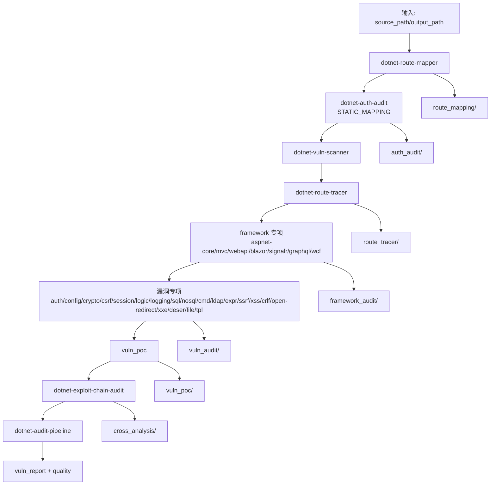
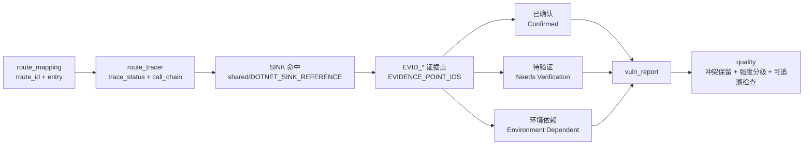

# dotnet-security-audit-skill

面向 .NET 生态的白盒代码安全审计 Skill 仓库。

该项目聚焦“结构化审计”而不是一次性结论输出：先完成入口建模，再做路由追踪与证据闭合，最后进行漏洞专项、利用链聚合与质量汇总，确保结论可复核、可追责、可复现。

## 项目目标

- 提供一套可复用的 .NET 代码安全审计 Skill 体系
- 统一 route/trace/framework/vuln/poc 的产物协议
- 用证据点约束结论强度，降低误报和漏报
- 覆盖现代与遗留 .NET Web 技术栈

## 适用范围

- ASP.NET Core
- ASP.NET MVC
- ASP.NET Web API
- Blazor
- SignalR
- GraphQL
- WCF
- 常见 .NET 基础类库与业务封装

## 仓库结构

```text
agents/
  安全专家.agent.md
  dotnet代码审计.agent.md

skills/
  README.md
  dotnet-audit-pipeline/
  dotnet-route-mapper/
  dotnet-route-tracer/
  dotnet-vuln-scanner/
  dotnet-aspnet-core-audit/
  dotnet-mvc-audit/
  dotnet-webapi-audit/
  dotnet-blazor-audit/
  dotnet-signalr-audit/
  dotnet-graphql-audit/
  dotnet-wcf-audit/
  dotnet-auth-audit/
  dotnet-config-audit/
  dotnet-crypto-audit/
  dotnet-csrf-audit/
  dotnet-session-cookie-audit/
  dotnet-logic-audit/
  dotnet-logging-audit/
  dotnet-sql-audit/
  dotnet-nosql-audit/
  dotnet-cmd-audit/
  dotnet-ldap-audit/
  dotnet-expr-audit/
  dotnet-ssrf-audit/
  dotnet-xss-audit/
  dotnet-crlf-audit/
  dotnet-open-redirect-audit/
  dotnet-xxe-audit/
  dotnet-deser-audit/
  dotnet-file-read-audit/
  dotnet-file-upload-audit/
  dotnet-file-write-audit/
  dotnet-filesystem-audit/
  dotnet-archive-extract-audit/
  dotnet-tpl-audit/
  dotnet-exploit-chain-audit/
  memory/

shared/
  DOTNET_AUDIT_GRABBER_INDEX.md
  DOTNET_FRAMEWORK_SKILL_TEMPLATE.md
  DOTNET_ROUTE_OUTPUT_TEMPLATES.md
  DOTNET_SINK_REFERENCE.md
  DOTNET_VULN_POC_TEMPLATE.md
  DOTNET_VULN_SKILL_TEMPLATE.md
  EVIDENCE_POINT_IDS.md
  IO_PATH_CONVENTION.md
  SEVERITY_RATING.md
```

## 核心设计原则

- 证据契约优先：高风险结论需关联 EVID_* 证据点
- 路由与参数先行：漏洞结论必须建立在入口建模基础上
- Trace 闭合优先：没有足够链路证据时，只能输出待验证或环境依赖
- Pipeline 结构化消费：按阶段产物汇总，而不是只看是否“执行过”
- 默认落盘：关键中间产物必须持久化，不应仅存在于最终摘要

## 典型审计流程

建议按以下顺序执行：

1. dotnet-route-mapper
2. dotnet-auth-audit（STATIC_MAPPING）
3. dotnet-vuln-scanner
4. dotnet-route-tracer
5. framework 专项（aspnet-core/mvc/webapi/blazor/signalr/graphql/wcf）
6. 漏洞专项（按风险面选择）
7. vuln_poc
8. dotnet-exploit-chain-audit
9. dotnet-audit-pipeline

### 架构流程图



### 证据闭合视图



## 关键输入与输出

### 输入

- source_path：待审计 .NET 项目或解决方案路径
- output_path：输出目录（可选，通常默认为 `{source_path}_audit`）

### 主要输出目录（推荐）

- route_mapping/
- auth_audit/
- route_tracer/
- framework_audit/
- vuln_audit/
- vuln_poc/
- cross_analysis/
- vuln_report/
- quality/

建议每个阶段至少落一个 `index_{timestamp}.md`。即使无结果，也应显式记录原因（例如未执行、仅初筛、证据不足、环境依赖、不适用）。

## 执行状态约定

漏洞专项执行状态建议统一为：

- NOT_RUN
- INITIAL_SCREENED
- PARTIAL
- COMPLETED
- NOT_APPLICABLE

这可以避免“未发现即未记录”的静默盲区。

## 必读规范

开始编写或扩展 Skill 前，建议优先阅读：

1. shared/EVIDENCE_POINT_IDS.md
2. shared/IO_PATH_CONVENTION.md
3. shared/DOTNET_SINK_REFERENCE.md
4. shared/DOTNET_AUDIT_GRABBER_INDEX.md
5. shared/DOTNET_ROUTE_OUTPUT_TEMPLATES.md
6. shared/DOTNET_VULN_SKILL_TEMPLATE.md
7. shared/DOTNET_FRAMEWORK_SKILL_TEMPLATE.md
8. shared/SEVERITY_RATING.md

## 如何扩展新 Skill

### 新增漏洞专项

- 以 `shared/DOTNET_VULN_SKILL_TEMPLATE.md` 起稿
- 显式声明与 route-tracer/framework_audit 的消费关系
- 引用对应 EVID_* 证据点
- 输出已确认、待验证、环境依赖三类结论

### 新增框架专项

- 以 `shared/DOTNET_FRAMEWORK_SKILL_TEMPLATE.md` 起稿
- 明确中间件顺序、过滤器覆盖、鉴权策略绑定与序列化边界
- 输出供漏洞专项复用的前置事实

### 调整路由追踪产物

- 优先修改 `shared/DOTNET_ROUTE_OUTPUT_TEMPLATES.md`
- 再同步 route-mapper 与 route-tracer Skill

## 质量与协作建议

- 不要在多个文件维护重复规范，统一回收到 shared/
- 任何高危结论都应可追溯到 route_id、trace_status、sink evidence
- pipeline 汇总时保留证据冲突，不做静默覆盖
- 对于环境依赖项，明确触发前提与验证建议

## 项目现状

当前仓库已具备：

- 完整的 .NET 安全审计 Skill 族
- 路由建模与追踪模板
- 漏洞专项与框架专项模板
- pipeline 结构化编排能力
- 会话恢复辅助文档（skills/memory）

如需深入了解 Skill 使用细节，请继续阅读 `skills/README.md`。
